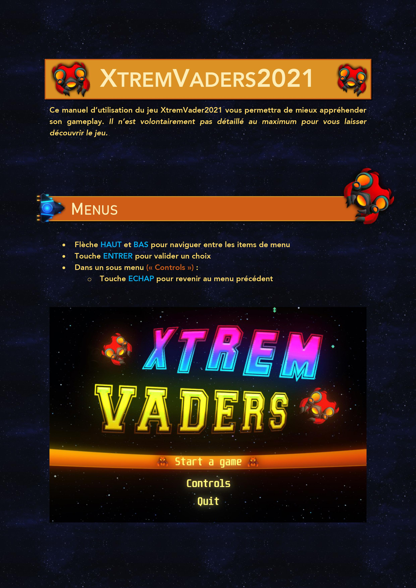
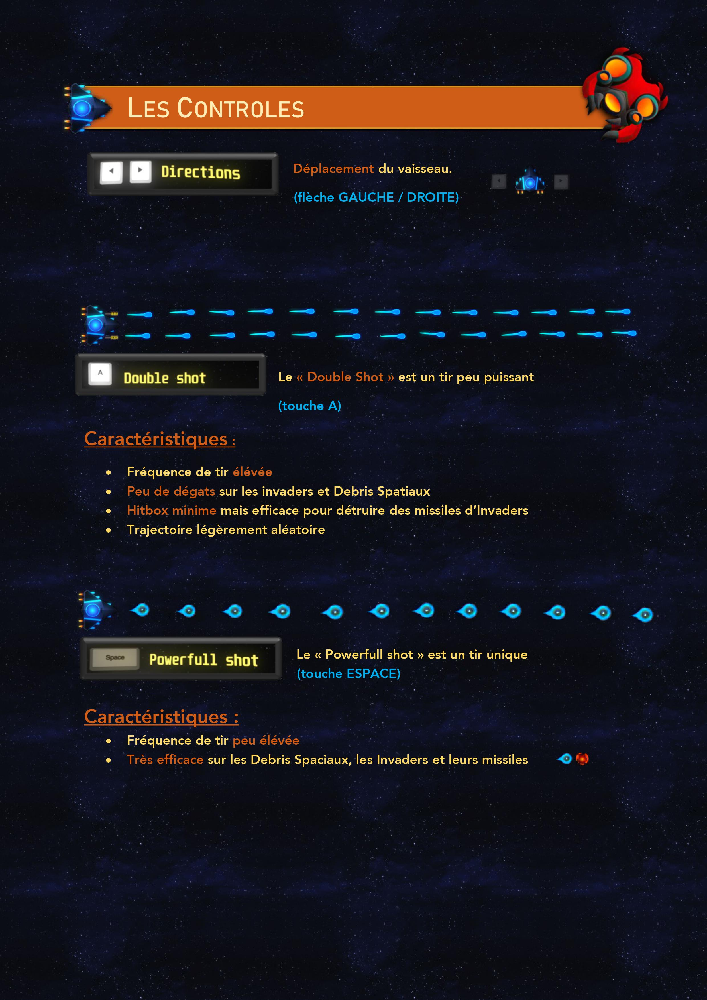
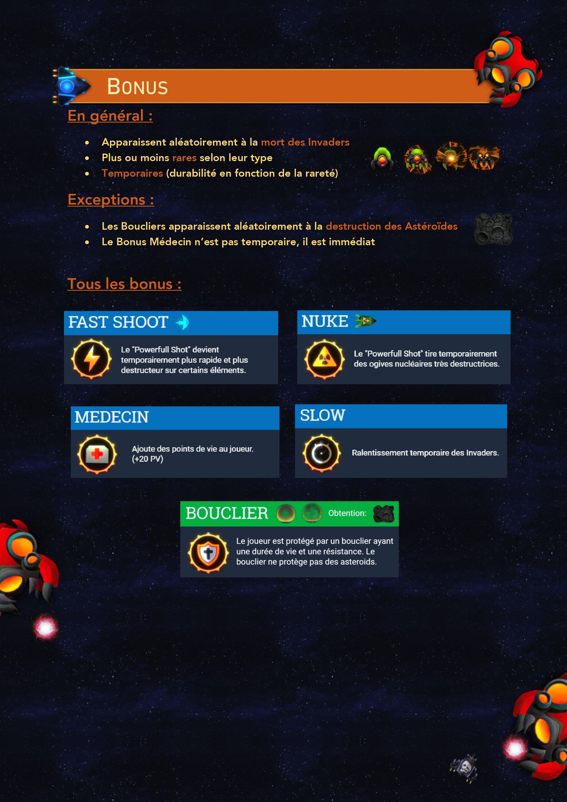

<h2>Qu'est-ce qu'XtremVaders ❓</h2>

  

XTremVaders est un jeu en deux dimensions inspiré du célèbre jeu Space Invaders. Il s'agit d'un shoot' em fixe.
Le principe est de détruire des vagues d'aliens au moyen de différents canons laser en se déplaçant horizontalement sur l'écran. Les ennemis tués peuvent lâcher différents bonus qui peuvent aider le joueur a gagner la partie contre les aliens. Plus la partie avance, plus le joueur a de chance de tomber sur un ennemi surpuissant.

<i>:warning: Ce projet a été réalisé dans un cadre pédagogique. À ce titre, il n'a pas vocation à être utilisé en-dehors de ce cadre. 
Les différents éléments scénaristiques, lieux et personnages utilisés dans ce projet appartiennent à leurs propriétaires respectifs.</i>

<h2>💻Technologies utilisée</h2>
<h3>Langages</h3>
<ul>
  <li>Java</li>
</ul>
<h3>EDI & Logiciels</h3>
<ul>
  <li>Netbeans</li>
  <li>Github Desktop</li>
  <li>Visual Paradigm</li>
  <li>Adobe After Effects</li>
</ul>

<h2>:books:Librairie fournie</h2>

Un moteur de jeu a été fournie par les enseignants 

<h2>1) Mon rôle</h2>
Durant ce projet j'ai réaliser la conception UML du jeu mais aussi de nombreuses fonctionnalités telles que:
  - Système de mouvement des Invaders
  - Système de tir
  - Système de bonus
  
<h2>2) Comment jouer au jeu?</h2>

  
  
  

<h2>3) Qu'est-ce que ce projet m'a apporté❓</h2>
Ce projet m'a permis d'améliorer ma vision d'un projet dans le sens général du terme. En effet, durant ce projet, nous devions réaliser entièrement l'analyse, la conception et la programmation du jeu. Grâce à lui je me suis amélioré dans la conception objet. J'ai pu apprendre à factoriser au maximum les éléments afin d'avoir un programme plus concis et permettant de rajouter plus facilement des fonctionnalités.
